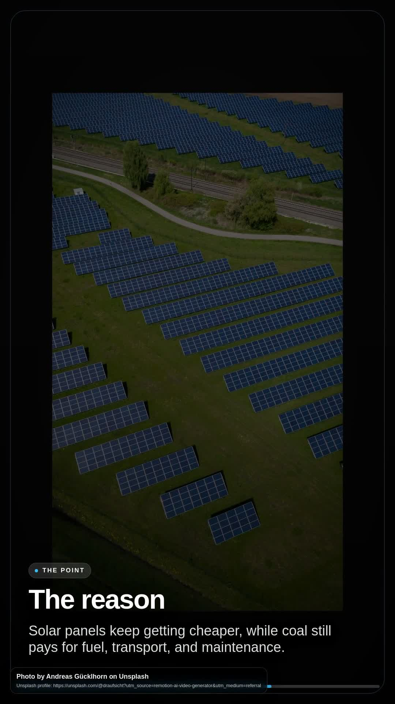

# RemotionVidCreator — brief-to-video workflow for Remotion

Turn a topic or creative brief into a customizable explainer video, then render
the H.264 MP4 on your machine. Use the local browser workspace for a guided 9:16
workflow or the CLI for repeatable, multi-ratio renders.

[](https://othmaneblial.github.io/RemotionVidCreator/)
[](https://othmaneblial.github.io/RemotionVidCreator/evidence/unsplash-production/explain-why-solar-energy-is-becoming-cheaper-than-coal-in-plain--1777448468216.mp4)
[](LICENSE)

<p align="center">
  <a href="https://othmaneblial.github.io/RemotionVidCreator/evidence/unsplash-production/explain-why-solar-energy-is-becoming-cheaper-than-coal-in-plain--1777448468216.mp4">
    
  </a>
</p>

> [Watch the real 10-second output](https://othmaneblial.github.io/RemotionVidCreator/evidence/unsplash-production/explain-why-solar-energy-is-becoming-cheaper-than-coal-in-plain--1777448468216.mp4) · 1080×1920 · H.264/AAC · visible Unsplash attribution

## Why this exists

Remotion is a capable rendering framework; managed APIs are good at rendering
templates at scale. RemotionVidCreator owns a narrower job between those layers:
getting from an unstructured idea to a reviewable, reproducible vertical video
without building a timeline by hand or sending the final render to a managed
rendering service.

The workflow is deliberately opinionated:

```text
topic or brief → script + creative direction → visual/audio plan → local Remotion render → MP4
```

## What it can do

- **Topic or brief to MP4** — build a structured explainer and render it with Remotion.
- **Guided browser workspace** — choose duration, tone, audience, platform,
  pacing, style, narrative, intensity, motion, and visual density.
- **Useful no-key first run** — use the template script fallback and bundled
  offline image library before connecting providers.
- **Optional AI scripting** — connect Z.ai through its Anthropic-compatible API.
- **Optional Unsplash visuals** — search topic-aware photos, trigger download
  tracking, preserve photographer credits, and show the hourly request budget.
- **Local job orchestration** — a Python loopback service owns queueing, progress,
  history, and the TypeScript render worker.
- **Procedural audio bed** — synthesize deterministic ambient WAV audio locally.
- **Multiple CLI ratios** — render 9:16, 16:9, 1:1, 4:5, or 4:3 video.

## Quick start

### Prerequisites

- Node.js with npm
- Python 3
- A supported local environment for Remotion/Chromium rendering

### First no-key render

```bash
git clone https://github.com/OthmaneBlial/RemotionVidCreator.git
cd RemotionVidCreator
npm ci
cp .env.example .env
npm start
```

Open `http://localhost:3005` if the workspace does not open automatically. The
default form uses the offline image library, and script generation falls back to
a local template when `ZAI_API_KEY` is absent.

### Enable online scripting and images

Edit the ignored `.env` file:

```dotenv
ZAI_API_KEY=your_zai_api_key
UNSPLASH_ACCESS_KEY=your_unsplash_access_key
UNSPLASH_UTM_SOURCE=remotion-ai-video-generator
```

The current renderer uses only the Unsplash access key. Do not expose the
Unsplash secret key in browser code, screenshots, logs, issues, or commits.

## Use the browser workspace

```bash
npm start
```

The local page sends jobs to the Python service on `127.0.0.1:3010`. One render
runs at a time. Progress, diagnostics, previous briefs, and output paths stay in
the ignored `.cache/` and `output/` directories.

## Use the CLI

```bash
# Template script, no downloaded images
npm run generate -- "Why local-first tools matter" --no-images

# AI-assisted 9:16 explainer
npm run generate -- "Quantum computing without the hype" \
  --use-ai \
  --style documentary \
  --audience founders \
  --platform shorts

# Horizontal output with a custom creative brief
npm run generate -- "How solar panels became cheaper" \
  --aspect 16:9 \
  --tone informative \
  --brief "Use concrete comparisons and avoid predictions"
```

The classic CLI downloads Picsum images unless `--no-images` is set. The guided
browser workspace instead defaults to the bundled offline library and can opt
into Unsplash.

### CLI options

| Option         | Values                                                                                    | Purpose                          |
| -------------- | ----------------------------------------------------------------------------------------- | -------------------------------- |
| `--tone`       | `informative`, `casual`, `professional`, `dramatic`, `humorous`, `storytelling`           | Script voice                     |
| `--complexity` | `simple`, `medium`, `detailed`                                                            | Content depth                    |
| `--style`      | `cinematic`, `educational`, `bold`, `playful`, `premium`, `documentary`                   | Creative preset                  |
| `--audience`   | `general`, `beginners`, `students`, `creators`, `founders`, `executives`, `professionals` | Target viewer                    |
| `--platform`   | `tiktok`, `reels`, `shorts`, `vertical`                                                   | Platform-aware direction         |
| `--intensity`  | `safe`, `balanced`, `wild`                                                                | Visual energy                    |
| `--motion`     | `minimal`, `medium`, `high`                                                               | Motion level                     |
| `--density`    | `minimal`, `balanced`, `rich`                                                             | Visual density                   |
| `--narrative`  | `problem-solution`, `myth-busting`, `timeline`, `comparison`, `transformation`            | Story structure                  |
| `--aspect`     | `9:16`, `16:9`, `1:1`, `4:5`, `4:3`                                                       | Output ratio                     |
| `--audio-mood` | text                                                                                      | Ambient audio direction          |
| `--focus`      | `full`, `hook`, `middle`, `outro`                                                         | Regeneration focus               |
| `--brief`      | text                                                                                      | Extra creative constraints       |
| `--output`     | path                                                                                      | Custom output path               |
| `--no-images`  | flag                                                                                      | Skip CLI image downloads         |
| `--use-ai`     | flag                                                                                      | Use the configured Z.ai endpoint |

## What runs where

| Stage               | Default/local behavior                             | Optional network behavior                                                    |
| ------------------- | -------------------------------------------------- | ---------------------------------------------------------------------------- |
| Workspace and queue | Local Node page and Python loopback service        | None                                                                         |
| Script              | Local template/demo fallback                       | Topic and brief go to the configured Z.ai endpoint                           |
| Visuals             | Bundled offline categories in the browser workflow | Unsplash searches in online mode; the classic CLI can download Picsum images |
| Context             | Template knowledge                                 | The classic CLI can query Wikipedia                                          |
| Audio               | Procedural ambient WAV generated locally           | None                                                                         |
| Render and output   | Remotion renders H.264 MP4 locally                 | Selected remote images/fonts may be fetched during rendering                 |

Rendering, local job state, history, and final MP4 files stay on your machine.
When you enable an online script or image path, that provider receives the
relevant prompt or search query.

## Architecture

```text
Browser workspace (bin/ai-mode.ts)
        │ HTTP on localhost
        ▼
Python queue (backend/server.py)
        │ starts one worker
        ▼
Render worker (bin/backend-render.ts)
   ├── script + creative direction
   ├── offline library or Unsplash
   ├── procedural ambient audio
   └── Remotion bundle + H.264 render
        ▼
output/ai-mode/*.mp4
```

The primary composition lives in
`src/compositions/ExplainerVideo/ExplainerVideo.tsx`. Input props are validated
with Zod, and the default composition is 1080×1920 at 30 fps.

## Validate a change

```bash
npm run check
npm audit
```

`npm run check` runs the output-path tests, TypeScript typecheck, and a Remotion
composition bundle/metadata check. For renderer changes, also generate a short
video and inspect it with a media probe and a real player.

## Known limits

- This is not a timeline editor, hosted rendering API, or text-to-video model.
- The browser workspace currently targets 9:16; the CLI exposes the other ratios.
- Audio is an ambient bed, not voice-over, narration, captions, or transcription.
- One browser job runs at a time; there is no cancellation control yet.
- Render speed and maximum practical duration depend on the local machine.
- The offline image library is intentionally small and covers a limited set of topics.
- Online modes depend on provider availability, quotas, credentials, and terms.
- Cross-platform packaging and a full browser/device compatibility matrix are not yet published.

## Roadmap

The next high-value milestones are tracked in [ROADMAP.md](ROADMAP.md):

1. import local media and make every render reproducible from a manifest;
2. add captions with editable timing and `.srt` export;
3. add batch input, dry runs, retries, and machine-readable CLI results;
4. introduce cancellation and stronger failure recovery;
5. package verified releases for supported platforms.

## Contributing and security

Read [CONTRIBUTING.md](CONTRIBUTING.md) before proposing a change. Report
vulnerabilities privately as described in [SECURITY.md](SECURITY.md).

## License

The original code in this repository is available under the [MIT License](LICENSE).

Remotion is a separate source-available dependency governed by the Remotion
License. Depending on organization size and use case, downstream users may need
a Remotion company license. Review the
[official Remotion license terms](https://github.com/remotion-dev/remotion/blob/main/LICENSE.md)
before commercial deployment.

## Links

- [Project website](https://othmaneblial.github.io/RemotionVidCreator/)
- [Real 10-second demo MP4](https://othmaneblial.github.io/RemotionVidCreator/evidence/unsplash-production/explain-why-solar-energy-is-becoming-cheaper-than-coal-in-plain--1777448468216.mp4)
- [Releases](https://github.com/OthmaneBlial/RemotionVidCreator/releases)
- [Unsplash production evidence](docs/evidence/unsplash-production/README.md)
